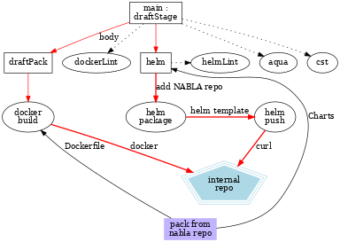

## [](https://github.com/AlbanAndrieu) jenkins-pipeline-scripts

[](http://www.apache.org/licenses/LICENSE-2.0.html)
[](https://opensource.org/licenses/MIT)
[](https://gitter.im/jenkins-pipeline-scripts/Lobby?utm_source=badge&utm_medium=badge&utm_campaign=pr-badge)
[](https://gitter.im/AlbanAndrieu/warnings-plugin?utm_source=badge&utm_medium=badge&utm_campaign=pr-badge&utm_content=badge)
[](https://img.shields.io/badge/java-1.8-yellow.svg)

[](https://jenkins.io/download/)
[](https://github.com/AlbanAndrieu/jenkins-pipeline-scripts/releases)

[](https://www.codacy.com/app/uhafner/jenkins-pipeline-scripts?utm_source=github.com&amp;utm_medium=referral&amp;utm_content=AlbanAndrieu/jenkins-pipeline-scripts&amp;utm_campaign=Badge_Grade)
[](https://codecov.io/gh/AlbanAndrieu/jenkins-pipeline-scripts)
[](https://github.com/AlbanAndrieu/jenkins-pipeline-scripts/pulls)

# Table of contents

<!-- toc -->

- [Usage](#usage)
- [Update README.md Table of Contents](#update-readmemd-table-of-contents)

<!-- tocstop -->

*NOTE: This repository is being deprecated internally at Nabla and hence
will receive few updates going forward.*

Usage
-----

This repository contains helper functions and classes to be used with the Jenkins Pipeline Plugin.
This repository is used on http://albandrieu.com:8686/jenkins/ and other Jenkins instances managed by Nabla.

Below feature have been removed on purpose
 * [tee](https://jenkins.io/doc/pipeline/steps/pipeline-utility-steps/#-tee-%20tee%20output%20to%20file)

To use this library from your `Jenkinsfile`,
make sure you have installed the _GitHub Organization Folder_ in version 1.5 or later,
then start off with:

```groovy
@Library('jenkins-pipeline-scripts@develop') _
```

OR (if jenkins is managing the version, the prefered way)

```groovy
@Library('jenkins-pipeline-scripts') _
```
In jenkins use Load implicitly

See [Extending with Shared Libraries](https://jenkins.io/doc/book/pipeline/shared-libraries/) for more
information on Jenkins pipeline extensions.

See also [Best Practices For Pipeline Code](https://jenkins.io/blog/2017/02/01/pipeline-scalability-best-practice/)

Run test

```
./mvnw -Dtest=TestSharedLibrary test
```


Docker
-----------

Build and Run

```
$ docker build -t groovy-test .
#You can reproduce issue `Conflicting module versions. Module [groovy-all is loaded in version 2.4.8 and you are trying to load version 2.4.12` with
$ docker run -it groovy-test:latest
```

Kubernetes
-----------

[cheatsheet](https://kubernetes.io/fr/docs/reference/kubectl/cheatsheet)
[conventions](https://helm.sh/docs/chart_best_practices/conventions/)

Install [microk8s](https://ubuntu.com/blog/deploying-kubernetes-locally-microk8s)

[Make](https://microk8s.io/docs/registry-images) docker image available to microk8s

```
$docker save nabla/jenkins-pipeline-scripts:1.0.0 > jenkins.tar
$microk8s ctr image import jenkins.tar

$microk8s ctr images ls
```
Create jenkins namespace

```
$k apply -f jenkins-namespace.yaml
```

Add [deployment](https://kubernetes.io/fr/docs/concepts/workloads/controllers/deployment/)

```
k config get-contexts
k config use-context microk8s
```

```
$ #k delete pods --all
#k delete -f jenkins-deployment.yaml
$k apply -f jenkins-deployment.yaml

$k get deployments jenkins --watch
$k describe pod | grep jenkins
#stop deployement
$k scale --replicas=0 deployment/jenkins
```

Copy volume data

```
cp -r /jenkins/* /mnt/jenkins
chown -R albandrieu:docker /mnt/jenkins
```

Add service

```
$k create -f jenkins-service.yaml
$k get service
$k logs jenkins-698d88d89d-vtwzf

```

Check http://127.0.0.1:30603/

TODO Add [PersistentVolume](https://kubernetes.io/docs/tasks/configure-pod-container/configure-persistent-volume-storage/#create-a-persistentvolume)


```
$k create -f jenkins-volume.yaml

#k describe pv
```


```
$k exec -it jenkins-master-7b49df974d-kzlrg -n jenkins -- /bin/bash
```

[service-account-tokens](https://kubernetes.io/docs/reference/access-authn-authz/authentication/#service-account-tokens)

```
$k create serviceaccount jenkins-account -n jenkins
$k get serviceaccounts jenkins-account -o yaml  -n jenkins
$k get secret jenkins-token-2dmg9 -o yaml  -n jenkins
```

[set-up-jenkins-in-a-kubernetes-cluster](https://medium.com/swlh/set-up-jenkins-in-a-kubernetes-cluster-96660c8d9ab)

```
$k apply -f jenkins-resourcequota.yaml -n jenkins
$k apply -f jenkins-role.yaml -f jenkins-serviceaccount.yaml -f jenkins-rolebinding.yaml -n jenkins
$k apply -f jenkins-deployment.yaml -n jenkins

$k get pods -n jenkins
$k -n jenkins port-forward jenkins-master-7b49df974d-kzlrg 8080:8080

$k get svc -n jenkins
```

See [dns-debugging-resolution](https://kubernetes.io/docs/tasks/administer-cluster/dns-debugging-resolution/)

```
$k get pods --namespace=kube-system -l k8s-app=kube-dns

$k -n kube-system describe configmap/coredns
$#Add 10.21.200.3 10.25.200.3 before google DNS
$k -n kube-system edit configmap coredns
```

Add k8s jenkins-account to jenkins
[set-up-jenkins-in-a-kubernetes-cluster](https://medium.com/swlh/quick-and-simple-how-to-setup-jenkins-distributed-master-slave-build-on-kubernetes-37f3d76aae7d)


```
$kubectl get secret $(kubectl get sa jenkins-account -n jenkins -o jsonpath={.secrets[0].name}) -n jenkins -o jsonpath={.data.token} | base64 --decode
$kubectl config view --minify | grep server | cut -f 2- -d ":" | tr -d " "
$kubectl get secret $(kubectl get sa jenkins-account -n jenkins -o jsonpath={.secrets[0].name}) -n jenkins -o jsonpath={.data.'ca\.crt'} | base64 --decode
```

Add k8s proxy


```
k get pod -n jenkins
k port-forward -n jenkins jenkins-master-6868bb694-m4jhb 8080:8080
http://localhost:8080/
```

TODO : Have proper DNS service

http://jenkins-master.jenkins.svc.cluster.local
mon-service.mon-namespace.svc.cluster.local

Update README.md Table of Contents
-----------------------------------


  * [github-markdown-toc](https://github.com/jonschlinkert/markdown-toc)
  * With [github-markdown-toc](https://github.com/Lucas-C/pre-commit-hooks-nodejs)

```
npm install --save markdown-toc
```

Graph dependency
----------------

  * [graphviz](https://www.graphviz.org/pdf/dotguide.pdf)

```
$ dot -Tps draftStage.gv -o draftStage.ps
$ dot -Tpng draftStage.gv > draftStage.png
```



========================

See [Extending environment variables with Shared Libraries](https://devops.datenkollektiv.de/programatically-add-environment-variables-to-a-jenkins-instance.html)

